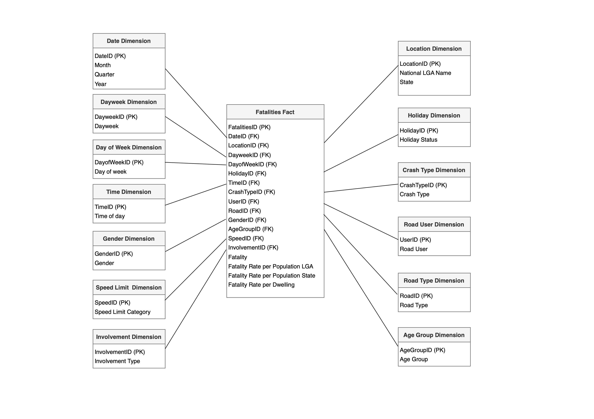
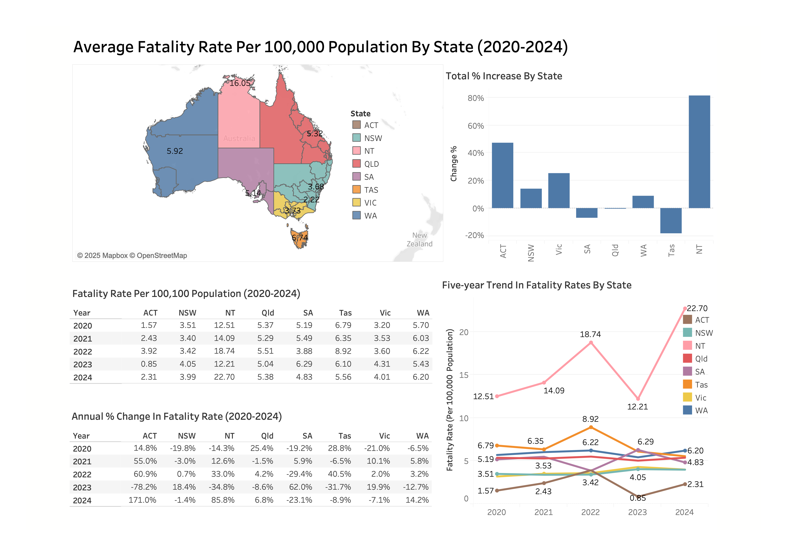

# Road Safety Data Warehousing and Analytics

This project presents an end-to-end **relational data warehousing and analytics pipeline** built on real-world road safety and fatality datasets from Australia.

It demonstrates how heterogeneous raw data can be transformed into a **dimensional data warehouse (star schema)** and queried to support analytical reporting and decision-making, with downstream visualization in Tableau.

## Project Overview

The project focuses on:
- Python-based **ETL pipelines** for integrating multiple raw data sources
- **Star schema design** for analytical querying
- SQL-based **business analytics queries** on a fact–dimension model
- Dashboard-driven insight generation using **Tableau**
- Pattern discovery using **association rule mining**

The workflow reflects a typical analytical data engineering process, from raw data preparation to structured storage and downstream analysis.

## Data Warehouse Design

- **Fact table**: `FactFatalities`
- **Dimensions** include:
  - Date, Day of Week, Time of Day
  - Location (State, LGA)
  - Road Type, Speed Limit
  - Road User, Gender, Age Group
  - Crash Type, Involvement Type, Holiday

The star schema is designed to support flexible aggregation across time, location, road conditions, and user characteristics.

Schema diagram:

## SQL Analytics

The SQL queries are designed to answer business-style analytical questions, such as:
- Which states have the highest average fatality rates over time
- How fatalities vary by gender and time of day
- Identification of high-risk LGAs under specific road and temporal conditions
- Relationships between road user types, age groups, and speed limits

The Tableau dashboards are built directly on top of the star-schema data warehouse and are driven by these analytical SQL queries.

## Tableau Dashboards

The Tableau dashboards provide visual insight into:
- Trends in fatality rates over time and by state
- Gender and time-of-day risk patterns
- Geographic distribution of fatalities by LGA
- Road type, speed limit, and user group risk profiles

A full dashboard export is available in `tableau/Tableau_Dashboard.pdf`.

## Example Dashboard

Additional dashboards are available in the `tableau/` directory.

## Academic Context

This work was completed as a **group project** for  
**CITS5504 – Data Warehousing**, University of Western Australia.

All components — including data modeling, ETL processing, SQL analytics, and visualization — were developed collaboratively.

**Contributors**
- Boya Zhang
- Lyu Lu

**Technologies**  
Python · SQL · Data Warehousing · Star Schema · ETL · Tableau